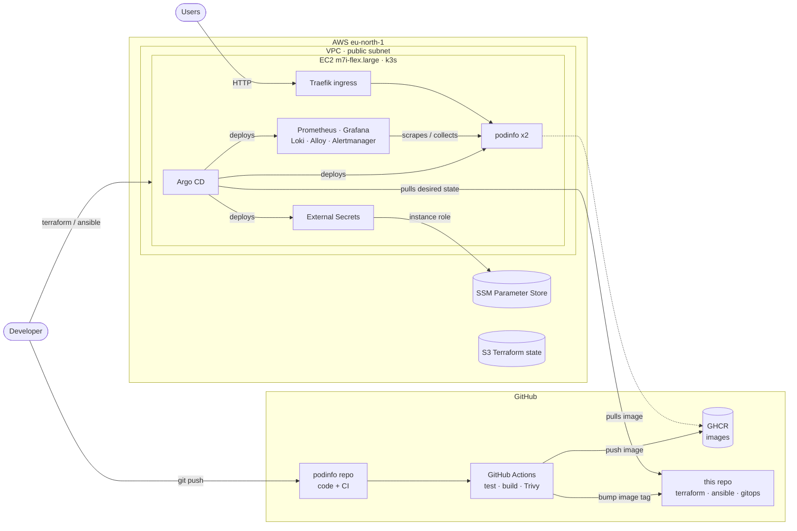
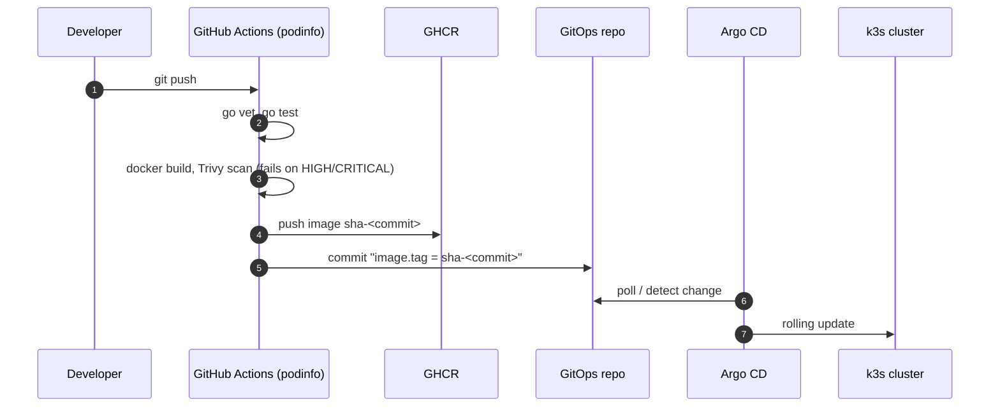

# AWS k3s GitOps Platform

[](https://github.com/TarikAZIKI/aws-k3s-gitops-platform/actions/workflows/terraform.yml)
[](https://github.com/TarikAZIKI/podinfo/actions/workflows/ci.yml)

A complete, low-cost DevOps platform on AWS: infrastructure as code, configuration
management, Kubernetes, GitOps delivery, CI with security scanning, observability and
secret management, all rebuilt from scratch in one command and torn down after every session.

- **Infrastructure**: Terraform (VPC, EC2, IAM, SSM, remote state in S3)
- **Configuration**: Ansible (OS updates, hardening, k3s, Argo CD bootstrap)
- **Kubernetes**: k3s on a single node
- **Delivery**: GitOps with Argo CD (app of apps)
- **CI**: GitHub Actions: tests, Docker build, Trivy scan, GHCR, automatic GitOps update
- **Observability**: Prometheus, Grafana, Loki, Alloy, Alertmanager
- **Secrets**: AWS SSM Parameter Store + External Secrets Operator

The demo application is a fork of [podinfo](https://github.com/stefanprodan/podinfo):
[TarikAZIKI/podinfo](https://github.com/TarikAZIKI/podinfo) holds its code and CI pipeline.

## Architecture



### From commit to production



Measured end to end: **about 4 minutes** from `git push` to the new version serving traffic,
with no command run against the cluster.

## Repository layout

```
.
├── terraform/
│   ├── bootstrap/        # Once: S3 state bucket, $5 budget alert, optional GitHub OIDC role
│   ├── modules/
│   │   ├── network/      # VPC, public subnet, Internet gateway (no NAT)
│   │   └── compute/      # Security group, IAM role (SSM read), EC2 instance
│   └── envs/dev/         # Assembles the modules, SSM secrets, remote state
├── ansible/
│   ├── site.yml
│   └── roles/
│       ├── common/       # Package upgrades, base tools, reboot when required
│       ├── hardening/    # SSH, unattended upgrades, kernel network settings
│       ├── k3s/          # Pinned k3s install, kubeconfig copied locally
│       └── argocd/       # Argo CD via the k3s Helm controller + root application
├── gitops/
│   ├── bootstrap/        # Root "app of apps"
│   ├── apps/             # One Argo CD Application per component
│   └── manifests/        # Alerts, dashboards, secret store, external secrets
├── .github/workflows/    # Terraform fmt + validate (+ plan through OIDC when enabled)
└── Makefile              # Single entry point: `make help`
```

## Getting started

### Prerequisites

- An AWS account and the AWS CLI signed in (`aws login --region eu-north-1`)
- `terraform` >= 1.10, `ansible`, `kubectl`, `make`

### One-time setup

```bash
cp terraform/bootstrap/terraform.tfvars.example terraform/bootstrap/terraform.tfvars  # set your email
make bootstrap   # state bucket + budget alert, writes terraform/envs/dev/backend.hcl
make init
```

### A working session

```bash
make session     # terraform apply + ansible: server, k3s, Argo CD (~12 min)
                 # Argo CD then deploys everything else from Git (~3 min)

make app-url            # public URL of podinfo
make argocd-password    # then: make argocd-ui  → https://localhost:8080 (user: admin)
make grafana-password   # then: make grafana-ui → http://localhost:3000  (user: admin)

make down        # destroy everything at the end of the session
```

Admin interfaces (Argo CD, Grafana) are never exposed publicly: they are only reachable
through `kubectl port-forward`. Only the application is served on ports 80/443.

## Design decisions

| Decision | Why |
|---|---|
| **k3s instead of EKS** | The EKS control plane alone costs ~$73/month. k3s is a certified Kubernetes distribution: the same manifests and Helm charts would run on EKS unchanged. |
| **Destroy after every session** | Everything is code, so the whole platform is rebuilt in ~15 minutes. Cost stays at a few dollars, and reproducibility is tested every time. |
| **Terraform + Ansible** | Terraform provisions cloud resources; Ansible configures the operating system. The Ansible inventory is generated from Terraform outputs. |
| **GitOps with Argo CD** | Git is the single source of truth. CI never gets cluster credentials, every deployment is a commit, a rollback is a `git revert`, and manual drift is reverted automatically (`selfHeal`). |
| **App of apps** | Adding a component to the cluster is adding one file to `gitops/apps/`. |
| **Argo CD installed through the k3s Helm controller** | Ansible only writes a `HelmChart` manifest, which keeps the bootstrap idempotent. |
| **Single public subnet, no NAT gateway** | A NAT gateway costs ~$35/month. Acceptable trade-off for a single-node lab (see limitations). |
| **No host firewall (ufw)** | It would conflict with the iptables rules k3s manages for pod networking; filtering is done by the AWS security group. |
| **m7i-flex.large** | The AWS free plan only allows Free Tier eligible instance types. 8 GB of RAM leaves room for Argo CD and the monitoring stack (~60% used). |
| **Image tags = commit SHA** | Exactly which code runs is always known. No `latest`. |
| **GitHub OIDC disabled by default** | Accounts created with the new AWS sign-up experience belong to an AWS-managed organization whose SCP denies `iam:CreateOpenIDConnectProvider`. The code is ready (`enable_github_oidc = true` on a standard account); storing long-lived AWS keys in GitHub was not an acceptable workaround. |

## Security

- **Network**: SSH (22) and the Kubernetes API (6443) are only open to the administrator's IP,
  recomputed on every `make` run. The VPC default security group is emptied.
- **Instance**: IMDSv2 required, encrypted root volume, SSH key only (no root login, no passwords),
  automatic security updates.
- **IAM least privilege**: the instance role can only read SSM parameters under `/devops-platform/*`.
  No AWS keys exist in the cluster or in GitHub.
- **Secrets**: generated by Terraform, stored encrypted in SSM Parameter Store, synced into the
  cluster by External Secrets Operator. No secret value is ever committed.
- **Supply chain**: GitHub Actions pinned by commit SHA, least-privilege workflow permissions,
  images scanned by Trivy before being pushed, multi-stage image running as non-root.
- **GitOps write access**: the podinfo pipeline uses a deploy key that can only write to this repository.

## Observability

- **Metrics**: Prometheus scrapes podinfo, the node and Kubernetes objects.
- **Logs**: Grafana Alloy tails every pod's logs and ships them to Loki.
- **Dashboard**: a `podinfo` Grafana dashboard (pods up, request rate, p95 latency, memory, logs),
  provisioned from Git.
- **Alerts**: `PodinfoDown` (no pod answering for 1 minute) and `PodinfoHighErrorRate` (> 5% of 5xx).
  Tested by scaling podinfo to zero through Git: the alert fired within 2 minutes and resolved
  seconds after a `git revert`.

## Cost

| Item | Price |
|---|---|
| EC2 m7i-flex.large (running) | ~$0.10/hour |
| Public IPv4 + 30 GB gp3 | ~$0.01/hour |
| S3 state bucket, SSM standard parameters, budget | ~$0 |

With `make down` after each session, the whole project costs a few dollars.
A budget alert emails the owner at 80% of $5/month.

## Limitations and next steps

What would change for a production setup:

- **High availability**: multiple nodes across availability zones (k3s HA with embedded etcd, or EKS).
- **Private networking**: nodes in private subnets behind a load balancer, NAT gateway for egress.
- **Access**: AWS SSM Session Manager instead of SSH, removing port 22 entirely.
- **TLS**: a real domain with cert-manager and Let's Encrypt.
- **Alert routing**: send Alertmanager notifications to email or Slack.
- **CI**: Terraform plan on pull requests through OIDC (ready, blocked by the account SCP),
  Argo CD managing its own installation.
- **Host keys**: verify SSH host keys instead of skipping them for ephemeral instances.

## Related repository

- [TarikAZIKI/podinfo](https://github.com/TarikAZIKI/podinfo): application code and CI pipeline
  (fork of [stefanprodan/podinfo](https://github.com/stefanprodan/podinfo), Apache 2.0).
